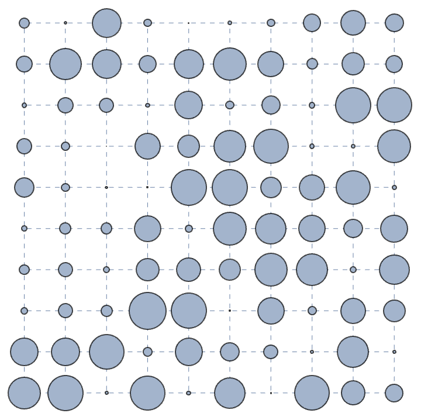
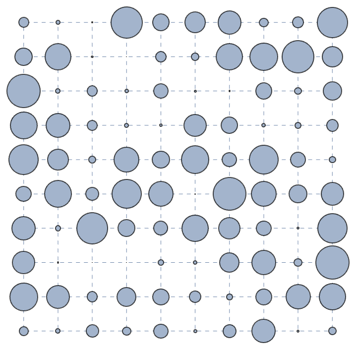
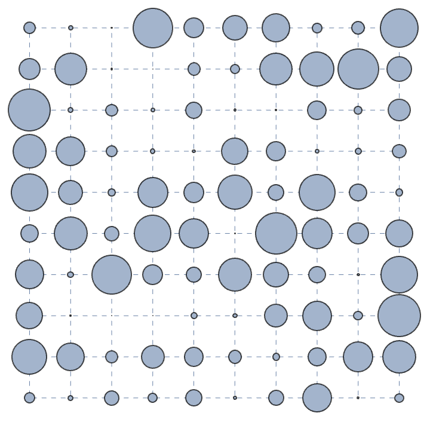

# discrete-graph-density-evolution
# Density Evolution on a Discrete Graph

**Wolfram Summer School 2023** · [📄 View on Wolfram Community](https://community.wolfram.com/groups/-/m/t/2960186) · ⭐ *Staff Pick — Featured Contributor*

A Mathematica investigation into how an initial density distribution evolves iteratively across a discrete lattice graph. Each node carries a density value, and at every iteration the density redistributes among neighboring nodes — revealing emergent clustering, flow patterns, and long-time behavior that echo physical systems like diffusion, structure formation, and network dynamics.

---

## Animated Evolution

The animation below shows how density clusters grow and redistribute across the graph over successive iterations. Node size is proportional to the local density — watch how structure emerges from the initial random configuration:

---

## Snapshots

| Iteration 1 | Iteration 10 |
|:-----------:|:------------:|
|  |  |

The contrast between early and late iterations clearly shows how density **clusters** form and consolidate over time — small fluctuations in the initial distribution are amplified into large coherent structures.

---

## Physics & Math Motivation

The evolution rule at each node $i$ is inspired by a discrete diffusion-like process on a graph $G = (V, E)$:

$$\rho_i^{(t+1)} = \rho_i^{(t)} + \alpha \sum_{j \in \mathcal{N}(i)} \left( \rho_j^{(t)} - \rho_i^{(t)} \right)$$

where:
- $\rho_i^{(t)}$ is the density at node $i$ at iteration $t$
- $\mathcal{N}(i)$ is the set of neighbors of node $i$
- $\alpha$ is a coupling parameter controlling the rate of redistribution

This discrete formulation is the graph-theoretic analog of the **continuous diffusion equation**:

$$\frac{\partial \rho}{\partial t} = \alpha \, \nabla^2 \rho$$

and has deep connections to:
- **Cosmological structure formation** — how matter clusters under gravity from small primordial fluctuations
- **Network science** — information or resource flow across complex networks
- **Cellular automata** — emergent complexity from simple local rules

---

## Tools

- **Wolfram Mathematica** — symbolic computation, graph construction, iterative simulation, visualization
- **Wolfram Language** — `Graph`, `GraphPlot`, `Manipulate`, `ListAnimate` for interactive exploration

---

## Files

| File | Description |
|------|-------------|
| `WSS23_ananya.nb` | Full Mathematica notebook with all code and interactive visualizations |
| `iterationPlot.gif` | Animated evolution of density distribution across iterations |
| `itr_1.png` | Snapshot at iteration 1 |
| `itr_10.png` | Snapshot at iteration 10 |

---

## Recognition

This project was selected as a **⭐ Staff Pick** by the Wolfram Community Editorial Board and earned the **Featured Contributor Badge**.

🔗 [View the full project on Wolfram Community](https://community.wolfram.com/groups/-/m/t/2960186)

---

## Author

**Ananya Mukherjee** · [github.com/ananyaM-Cosmo](https://github.com/ananyaM-Cosmo)    
